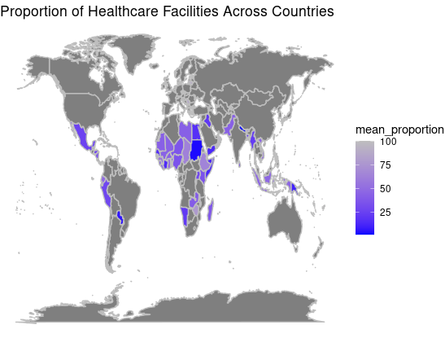
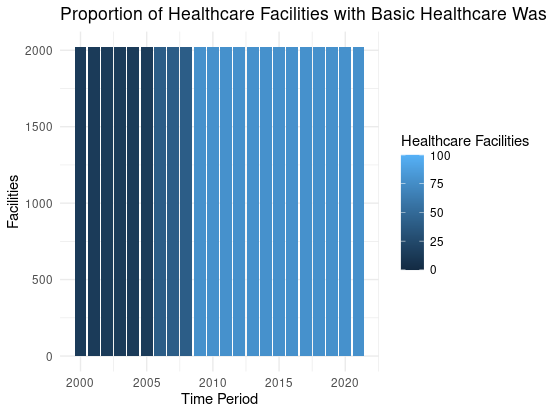
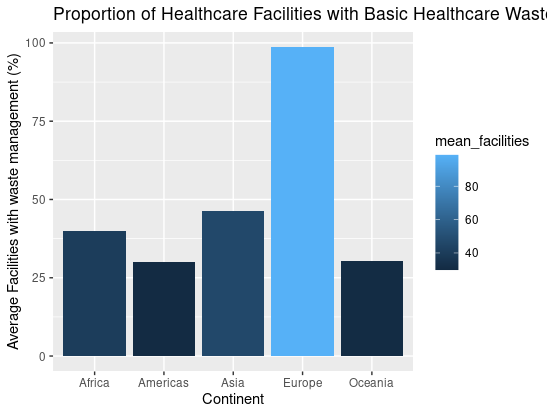

```{r setup, include=FALSE}
knitr::opts_chunk$set(echo = TRUE)
```

# [**UNICEF Healthcare Facilities Data Analysis Report**]{.underline}

## *Introduction*  {.Header style="color: Blue;"}

This report presents an analysis of the UNICEF Healthcare Facilities
dataset, which contains information on the proportion of healthcare
facilities with basic healthcare waste management services across
different countries and continents. The dataset also includes data on
the population growth and healthcare facilities for various countries
and years.

\_\_\_\_\_\_\_\_\_\_\_\_\_\_\_\_\_\_\_\_\_\_\_\_\_\_\_\_\_\_\_\_\_\_\_\_\_\_\_\_\_\_\_\_\_\_\_\_\_\_\_\_\_\_\_\_\_\_\_\_\_\_\_\_\_\_\_\_\_\_\_\_\_\_\_\_

#### World Map Chart: Proportion of Healthcare Facilities + Basic Waste Management services across Countries {.Header style="color: Purple;"}

{width="396"}

This report presents a world map chart that shows the proportion of
healthcare facilities with basic waste management services across
countries.The darker shades of blue indicate higher proportions, while
lighter shades of blue indicate lower proportions.The darker shades of
blue in some countries indicate that the proportion of healthcare
facilities with basic waste management services is relatively high.
However, in many countries, the proportion of healthcare facilities with
basic waste management services is low or even nonexistent. This is a
major public health concern that needs to be addressed to prevent the
spread of infectious diseases and protect public health.

\_\_\_\_\_\_\_\_\_\_\_\_\_\_\_\_\_\_\_\_\_\_\_\_\_\_\_\_\_\_\_\_\_\_\_\_\_\_\_\_\_\_\_\_\_\_\_\_\_\_\_\_\_\_\_\_\_\_\_\_\_\_\_\_\_\_\_\_\_\_\_\_\_\_\_\_

#### Bar Chart: Proportion increase in Healthcare Facilities over time  {.Header style="color: Purple;"}

{width="396"}

The above bar chart shows how there is an increase in healthcare
facilities over time. In this we can understand that as countries are
developing the healthcare facilities offered are increasing. It also
shows us that with time providing better healthcare facilities has
increased as people requirement has increased and this is possible with
the help of technology.

\_\_\_\_\_\_\_\_\_\_\_\_\_\_\_\_\_\_\_\_\_\_\_\_\_\_\_\_\_\_\_\_\_\_\_\_\_\_\_\_\_\_\_\_\_\_\_\_\_\_\_\_\_\_\_\_\_\_\_\_\_\_\_\_\_\_\_\_\_\_\_\_\_\_\_\_

####  Bar Chart: Proportion of Healthcare Facilities Across Continents  {.Header style="color: Purple;"}

{width="547" height="300"}

This data shows that Europe has the highest proportion followed by Asia,
, Africa, Americas and Oceania has the lowest average proportion. This
shows that developed countries are higher in proportion where as
developing countries are lower in proportion. This means that developed
countries have funds to investment in waste management , where as
developing countries are struggling.

\_\_\_\_\_\_\_\_\_\_\_\_\_\_\_\_\_\_\_\_\_\_\_\_\_\_\_\_\_\_\_\_\_\_\_\_\_\_\_\_\_\_\_\_\_\_\_\_\_\_\_\_\_\_\_\_\_\_\_\_\_\_\_\_\_\_\_\_\_\_\_\_\_\_\_\_

#### Scatterplot: Proportion of Healthcare Facilities + Waste Management Service VS Time with respect to individual access  {.Header style="color: Purple;"}

{width="396"}

From the scatterplot, we can see that as the proportion of healthcare
facilities with basic waste management services increases, individual
access to health services decreases. This negative relationship suggests
that there may be trade-offs between ensuring proper waste management in
healthcare facilities and ensuring access to health services for
individuals.

\_\_\_\_\_\_\_\_\_\_\_\_\_\_\_\_\_\_\_\_\_\_\_\_\_\_\_\_\_\_\_\_\_\_\_\_\_\_\_\_\_\_\_\_\_\_\_\_\_\_\_\_\_\_\_\_\_\_\_\_\_\_\_\_\_\_\_\_\_\_\_\_\_\_\_\_

#### Time Series Chart: World Population Growth {.Header style="color: Purple;"}

{width="396"}

As we can see from the chart, there is a increase in population over the
years. When we take the Scatterplot into consideration , we can
understand that as the world population increases, individual access to
healthcare facilities with basic waste management services decreases.
This could be due to the fact that as the population grows, there is a
higher demand for healthcare facilities and waste management services,
which may not be able to keep up with the increasing demand.

------------------------------------------------------------------------

### Conclusion {style="color: Black;"}

In conclusion, the data presented in this report highlights the
importance of providing healthcare facilities with basic waste
management services to ensure public health and prevent the spread of
infectious diseases.

-   The world map chart and bar chart show that while some countries
    have made significant progress in providing such facilities, many
    others are still struggling.

-   The Scatterplot shows a negative relationship between the proportion
    of healthcare facilities with basic waste management services and
    individual access to health services, suggesting that there may be
    trade-offs that need to be addressed.

-   Lastly, the time series chart shows that the increase in population
    is putting a strain on healthcare facilities and waste management
    services, highlighting the need for continued investment and
    improvement in these areas.

------------------------------------------------------------------------
